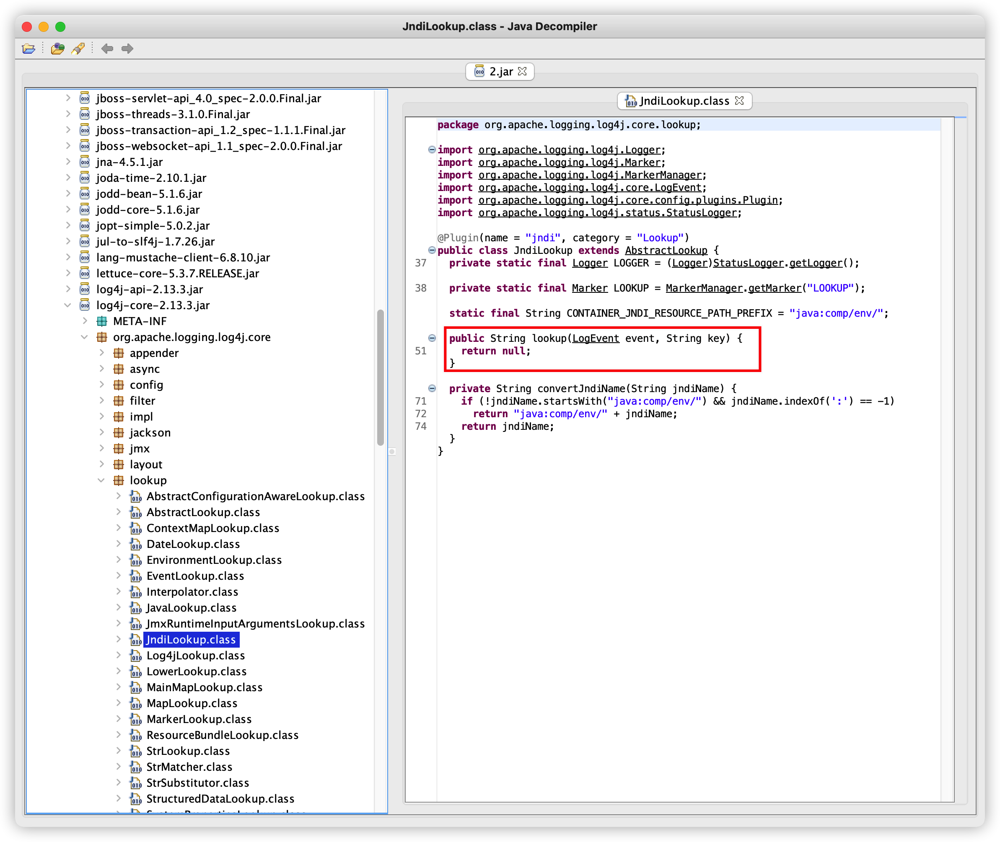

# Log4j修改jar字节码补丁工具

该项目采用了字节码技术实现了对log4j jar和`SpringBoot jar`的漏洞修复，运行补丁后会动态修改log4j jar包中的[org/apache/logging/log4j/core/lookup/JndiLookup.class](https://github.com/apache/logging-log4j2/blob/master/log4j-core/src/main/java/org/apache/logging/log4j/core/lookup/JndiLookup.java#L50)类的`lookup`方法，并返回`null`对象。

如下图：

## 使用方式

`java -jar log4j-patch.jar [jar路径]`，如：`java -jar log4j-patch.jar /data/log4j-core-2.12.1.jar`，或者`java -jar log4j-patch.jar /data/springboot-test.jar`